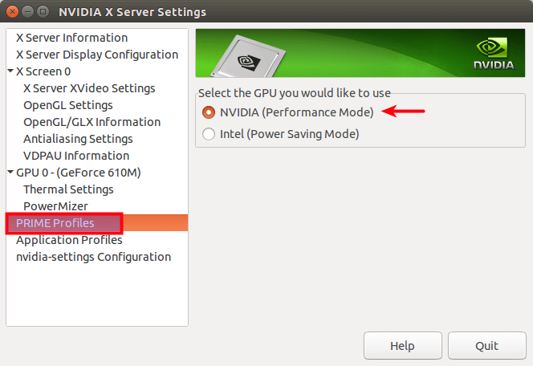

# DEEPSTREAM EXAMPLES

This directory contains DeepStream related examples. Example code, along with configuration files etc., are placed inside sub-directories.

---

# 1 List of Examples

List of examples:

* [deepstream-tracking](deepstream-tracking/README.md)
  * 4-class object detector with tracking
* [deepstream-tracking-parallel](deepstream-tracking-parallel/README.md)
  * 4-class object detector with tracking
  * Splits the input stream into two and runs two pipelines on the split streams
* [deepstream-triton-tracking](deepstream-triton-tracking/README.md)
  * 4-class object detector with tracking, uses local version of the Triton Inference Server for inference
* [deepstream-retinaface](deepstream-retinaface/README.md)
  * RetinaFace bbox- and landmark detector. Uses a custom parser

You can execute the examples either:

* using a Docker container (preferred way)
* installing all the required libraries in the host system (and run the risk of breaking your installation)

In the following you can find instructions for both installing a docker container or installing all the required
libraries and components in the host system.

---

# 2 Source Code

Some of the examples require C/C++ code to be built. You need the following to build the code:

* C++20 compatible compiler
* cmake >= 3.17
  * To install latest cmake versions, take a look at [https://apt.kitware.com/](https://apt.kitware.com/)
* deepstreamer
* nvidia drivers / cuda
* TensorRT

To build the code:

```shell
mkdir build
cd build
cmake-gui ..
make
```

---

# 3 Active Graphics Card

Before executing any of the examples, you need to install Nvidia driver. However, some systems have several graphics 
cards, i.e. you might have both an Nvidia GPU and an Intel integrated graphics controller.
You can verify this by running the following command:

```bash
lspci -k | grep -A 2 -i "VGA"
```

If you have a single Nvidia card, then something similar to the following will be reported:

```bash
0a:00.0 VGA compatible controller: NVIDIA Corporation GP104 [GeForce GTX 1070] (rev a1)
    Subsystem: ASUSTeK Computer Inc. GP104 [GeForce GTX 1070]
    Kernel driver in use: nvidia
```

However, if another card, that is not an Nvidia one, is reported, then you have to make sure that the Nvidia
one is activated. In Ubuntu, open `NVIDIA X Server Settings` by executing:

```bash
nvidia-settings
```

, and navigate to PRIME profiles and make sure that NVIDIA (Performance Mode) is activated:



You can switch between the cards as follows:

```bash
sudo prime-select <CARD>
```

, replace `<CARD>` with `intel` or `nvidia`.

---

# 3 Running the Examples Using Docker

This is the preferred way to run the tests. Before creating the docker image, you need to install Nvidia's Container Toolkit. Instructions can be found here:

* https://docs.nvidia.com/datacenter/cloud-native/container-toolkit/install-guide.html

Once you have installed everything, verify that Nvidia's Container Toolkit is working by executing:

```bash
sudo docker run --rm --gpus all nvidia/cuda:11.6.2-base-ubuntu20.04 nvidia-smi
```

You should see output following (or similar) output:

```bash
+-----------------------------------------------------------------------------+
| NVIDIA-SMI 525.60.13    Driver Version: 525.60.13    CUDA Version: 12.0     |
|-------------------------------+----------------------+----------------------+
| GPU  Name        Persistence-M| Bus-Id        Disp.A | Volatile Uncorr. ECC |
| Fan  Temp  Perf  Pwr:Usage/Cap|         Memory-Usage | GPU-Util  Compute M. |
|                               |                      |               MIG M. |
|===============================+======================+======================|
|   0  NVIDIA GeForce ...  On   | 00000000:09:00.0  On |                  N/A |
| 32%   38C    P0    34W / 151W |    735MiB /  8192MiB |      0%      Default |
|                               |                      |                  N/A |
+-------------------------------+----------------------+----------------------+
                                                                               
+-----------------------------------------------------------------------------+
| Processes:                                                                  |
|  GPU   GI   CI        PID   Type   Process name                  GPU Memory |
|        ID   ID                                                   Usage      |
|=============================================================================|
+-----------------------------------------------------------------------------+

```

## 3.1 Create the Docker Image

After this you can create the docker image used in the examples.

```bash
cd gstreamer-examples/docker
docker build -t nvidia-deepstream-samples -f ./Dockerfile-deepstream .
```

## 3.2 Test the Docker Image

Some of the examples use GStreamer plugin `nveglglessink` for showing the results in realtime. `nveglglessink`
depends on OpenGL, so making sure that OpenGL works inside the container is essential. Make sure that `DISPLAY`
environment variable has been set:

```bash
env | grep DISPLAY
```
If it is not set, then you need to set it:

```bash
export DISPLAY=:<DISPLAY_NR>
```

Replace `<DISPLAY_NR>` with the actual display which is typically `0` or `1`.

Then start the container:

```bash
xhost +
docker run -i -t --rm \
  -v /tmp/.X11-unix:/tmp/.X11-unix \
  -v $(pwd):/home/gstreamer-examples \
  -e DISPLAY=$DISPLAY \
  -e XAUTHORITY=$XAUTHORITY \
  -e NVIDIA_DRIVER_CAPABILITIES=all \
  --gpus all nvidia-deepstream-samples bash
```

Then execute the following inside the container:

```bash
glxinfo | grep OpenGL
```

You should see something similar to:

```bash
OpenGL vendor string: NVIDIA Corporation
OpenGL renderer string: NVIDIA GeForce GTX 1070/PCIe/SSE2
OpenGL core profile version string: 4.6.0 NVIDIA 525.60.13
OpenGL core profile shading language version string: 4.60 NVIDIA
OpenGL core profile context flags: (none)
OpenGL core profile profile mask: core profile
OpenGL core profile extensions:
OpenGL version string: 4.6.0 NVIDIA 525.60.13
OpenGL shading language version string: 4.60 NVIDIA
OpenGL context flags: (none)
OpenGL profile mask: (none)
OpenGL extensions:
OpenGL ES profile version string: OpenGL ES 3.2 NVIDIA 525.60.13
OpenGL ES profile shading language version string: OpenGL ES GLSL ES 3.20
OpenGL ES profile extensions:
```

If the `OpenGL vendor string` is `NVIDIA Corporation`, execute an OpenGL test application inside the container:

```bash
glmark2
```

A window should pop-up, displaying a horse.

## 3.3 Execute the Examples

Run the following, from the `gstreamer-examples` directory, in order to start the docker container in interactive
mode and run one of the examples:

```bash
xhost +
docker run -i -t --rm \
  -v /tmp/.X11-unix:/tmp/.X11-unix \
  -v $(pwd):/home/gstreamer-examples \
  -e DISPLAY=$DISPLAY \
  -e XAUTHORITY=$XAUTHORITY \
  -e NVIDIA_DRIVER_CAPABILITIES=all \
  --gpus all nvidia-deepstream-samples bash
cd /home/gstreamer-examples/deepstream-examples/deepstream-tracking
python3 gst-tracking.py -i /opt/nvidia/deepstream/deepstream-6.1/samples/streams/sample_1080p_h264.mp4
```

---

# 4 Running the Examples Without Docker

If you're not using Docker to run the examples, you need to install DeepStream, and Triton Inference Server if you are planning on
executing Triton related examples as well, in the host system. Due to the complexity of Nvidia's libraries, depending on the system your're using,
it is likely that your system might not work properly after installing everything, so I recommend using Docker instead. Following steps
are for:

* Ubuntu 20.04

## 4.1 Install DeepStream SDK

Follow these instructions for installing the DeepStream SDK 
[https://docs.nvidia.com/metropolis/deepstream/dev-guide/text/DS_Quickstart.html](https://docs.nvidia.com/metropolis/deepstream/dev-guide/text/DS_Quickstart.html).

After installation, verify that `nvinfer` plug-in can be found

```bash
gst-inspect-1.0 nvinfer
```

If it's not found, you might have to execute the following script:

```bash
sudo /opt/nvidia/deepstream/deepstream/install.sh
```

And then reboot.

## 4.2 Install DeepStream Python Bindings

Information regarding DeepStream Python bindings can be found from here [https://github.com/NVIDIA-AI-IOT/deepstream_python_apps](https://github.com/NVIDIA-AI-IOT/deepstream_python_apps).
You can download ready to install packages from here [https://github.com/NVIDIA-AI-IOT/deepstream_python_apps/releases](https://github.com/NVIDIA-AI-IOT/deepstream_python_apps/releases).
After downloading the corresponding wheel-package, you can install it by executing the following from the same directory where the package was downloaded:

```bash
pip3 install pyds-1.1.4-py3-none-linux_x86_64.whl
```

Replace `pyds-1.1.4-py3-none-linux_x86_64.whl` with the version that you downloaded.


## 4.3 Install Triton Inference Server

Before executing those examples that use Triton, you first need to install it locally. First install the following package(s):

```bash
sudo apt-get install libnccl2
```

Then clone the Triton repository and build it:

```bash
git clone git@github.com:triton-inference-server/server.git
cd server
git checkout tags/v2.29.0
python3 build.py \
    --enable-stats --enable-logging --enable-tracing --enable-gpu \
    --backend tensorrt --backend onnxruntime --backend python --backend pytorch --backend tensorflow2
```

Copy recently built backends where Triton can find them:

```bash
cd build/install
sudo cp -vr ./backends /opt/tritonserver
```

## 4.4 Set Environment Variables

Triton libraries need to be discoverable by the the dynamic library loader:

```bash
export LD_LIBRARY_PATH=${LD_LIBRARY_PATH}:<TRITON-SOURCE>/build/install/lib
```

Replace `<TRITON-SOURCE>` with the location where Triton source code was cloned.

By default `nvinferserver` Gst plug-in is not discoverable, so we need to add the following:

```bash
export GST_PLUGIN_PATH=/opt/nvidia/deepstream/deepstream/lib/gst-plugins/
```

Make sure that `trtexec` is found:

```bash
which trtexec
```

If it cannot be found, but it is installed, you can add it to path:

```bash
export PATH=${PATH}:/usr/src/tensorrt/bin/
```

## 4.5 Build the Model Repo

We will use the models shipped with the DeepStream SDK. However, first make sure that `trtexec` is found:

```bash
trtexec --version
```

Build the models shipped with DeepStream SDK

```bash
cd /opt/nvidia/deepstream/deepstream/samples
./prepare_ds_triton_model_repo.sh
```


## 4.6 Testing Triton Installation

Test that the `nvinferenceserver` plugin can be found

```
gst-inspect-1.0 nvinferserver
```

Test that the model repo can be loaded:

```
cd <TRITON-SOURCE>/build/install/bin
./tritonserver \
    --log-verbose=2 --log-info=1 --log-warning=1 --log-error=1 \
    --model-repository=/opt/nvidia/deepstream/deepstream/samples/triton_model_repo
```

Replace `<TRITON-SOURCE>` with the location where Triton source code was cloned.

---
