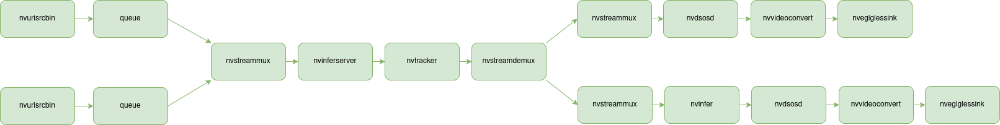

# 1 Deepstream Hybrid Inference

This directory contains examples related to running Triton models, with `Gst-nvinferserver`, and and non-Triton models, with `Gst-nvinfer`, in the same pipeline.
This kind of hybrid approach gives a lot of flexibility when it comes down to creating different image processing pipelines.


## 1.1 Running the Examples with Docker

First you need to start the Docker container, this can be done with the following:

```bash
docker compose up --build
```

, you only need to use the `--build` option when you bring up the service for the first time. Once
the Docker container is up and running, you can check the ID of the container using:

```bash
docker ps
```

, and then in order to join the running container, execute the following:

```bash
xhost +
docker exec -it <ID> bash
```

Once inside the docker, you need to change the directory to `/home/gstreamer_examples/`

```bash
cd /home/gstreamer_examples
ls -la
```

### 1.1.1  Single Pipeline

Following example executes a single image processing pipeline so that the detector (primary mode) runs locally in Triton and the classifier (secondary mode) that classifies
the car mmake/brand runs without Triton. You can launch the example by executing the following inside the `/home/gstreamer_examples/` directory:

```bash
gst-launch-1.0 \
nvurisrcbin uri=file:///opt/nvidia/deepstream/deepstream/samples/streams/sample_1080p_h264.mp4 ! \
m.sink_0 nvstreammux name=m width=1280 height=720 batch-size=1 ! \
nvinferserver config-file-path=/opt/nvidia/deepstream/deepstream/samples/configs/deepstream-app-triton/config_infer_plan_engine_primary.txt ! \
nvtracker tracker-width=640 tracker-height=480 ll-config-file=config_tracker_NvDCF_perf.yml \
ll-lib-file=/opt/nvidia/deepstream/deepstream/lib/libnvds_nvmultiobjecttracker.so ! nvinfer config-file-path=dstest2_sgie2_config.txt ! \
nvdsosd display-clock=1 ! nvvideoconvert ! nveglglessink
```

### 1.1.2 Pipeline with Two Branches

In this pipeline we process two different streams in the same detector (primary mode) running locally in Triton. After the tracker we split the streams using `nvstreamdemux` and
add a classifier (secondary mode) that classifies the car make/brand. The expectation is that the car model is displayed in the output in the branch that has the car make/brand classifier.
If the classifier is in the `src_0` branch then everything works as expected. However, if the classifier is in the `src_1` branch then this doesn't work. Figure 1. shows the pipeline.

<figure align="center">
    
    <figcaption>Figure 1. Hybrid pipeline with two branches.</figcaption>
</figure>

**This works in Deepstream 6.3**

In this case the classifier is in the `src_0` output of the `nvstreamdemuxer` and we can see the car make in the sink. You can launch the example by executing the following inside the `/home/gstreamer_examples/` directory:

```bash
gst-launch-1.0 -e \
nvstreammux name=mux width=1280 height=720 batch-size=2 ! \
nvinferserver config-file-path=/opt/nvidia/deepstream/deepstream/samples/configs/deepstream-app-triton/config_infer_plan_engine_primary.txt batch-size=2 ! \
nvtracker tracker-width=640 tracker-height=480 ll-config-file=config_tracker_NvDCF_perf.yml ll-lib-file=/opt/nvidia/deepstream/deepstream/lib/libnvds_nvmultiobjecttracker.so ! \
nvstreamdemux name=demux \
nvurisrcbin uri=file:///opt/nvidia/deepstream/deepstream/samples/streams/sample_1080p_h264.mp4 ! queue ! mux.sink_0 \
nvurisrcbin uri=file:///opt/nvidia/deepstream/deepstream/samples/streams/sample_1080p_h264.mp4 ! queue ! mux.sink_1 \
demux.src_0 ! queue ! nvinfer config-file-path=dstest2_sgie2_config.txt ! nvdsosd ! nvvideoconvert ! nveglglessink \
demux.src_1 ! queue ! nvdsosd ! nvvideoconvert ! nveglglessink
```

Figure 2. shows the pipeline that works.

<figure align="center">
    
    <figcaption>Figure 2. Pipeline that works.</figcaption>
</figure>

**This doesn't work in Deepstream 6.3**

In this case the classifier is in the `src_1` output of the `nvstreamdemuxer` and we don't' see the car make in the sink. You can launch the example by executing the following inside the `/home/gstreamer_examples/` directory:

```bash
gst-launch-1.0 -e \
nvstreammux name=mux width=1280 height=720 batch-size=2 ! \
nvinferserver config-file-path=/opt/nvidia/deepstream/deepstream/samples/configs/deepstream-app-triton/config_infer_plan_engine_primary.txt batch-size=2 ! \
nvtracker tracker-width=640 tracker-height=480 ll-config-file=config_tracker_NvDCF_perf.yml ll-lib-file=/opt/nvidia/deepstream/deepstream/lib/libnvds_nvmultiobjecttracker.so ! \
nvstreamdemux name=demux per-stream-eos=true \
nvurisrcbin uri=file:///opt/nvidia/deepstream/deepstream/samples/streams/sample_1080p_h264.mp4 ! queue ! mux.sink_0 \
nvurisrcbin uri=file:///opt/nvidia/deepstream/deepstream/samples/streams/sample_1080p_h264.mp4 ! queue ! mux.sink_1 \
demux.src_0 ! queue ! nvdsosd ! nvvideoconvert ! nveglglessink \
demux.src_1 ! queue ! nvinfer config-file-path=dstest2_sgie2_config.txt ! nvdsosd ! nvvideoconvert ! nveglglessink
```

Figure 3. shows the pipeline that does not work.

<figure align="center">
    
    <figcaption>Figure 3. Pipeline that doesn not work.</figcaption>
</figure>

