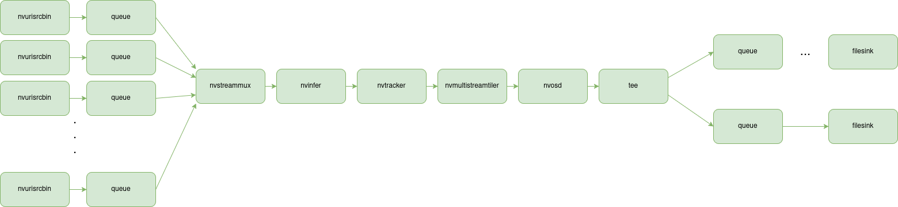

# 1 Deepstream Parallel Tracking

This example shows to split an input stream into two, using a tee-element, so that two different image processing pipelines can process the same stream.
This example processes the split streams using the same inference elements, but they can be different for each stream. It appears that you need to add an
nvstreammux-element into both of the processing streams, after the tee-element, in order for the nvtracker-element to work properly.

* PGIE_CLASS_ID_VEHICLE = 0
* PGIE_CLASS_ID_BICYCLE = 1
* PGIE_CLASS_ID_PERSON = 2
* PGIE_CLASS_ID_ROADSIGN = 3

# 2 Pipeline

Pipeline description.


# 3 Processing Pipeline Configurations

## 3.1 Pipeline 1

Configuration files for the inference- and tracker elements:

* Primary inference: 4-class detector
  * Configuration file: [pgie_config_1.txt](pgie_config_1.txt)
* Secondary inference 1: vehicle color classifier
  * Configuration file: [sgie1_config_1.txt](sgie1_config_1.txt)
* Secondary inference 2: vehicle make classifier
  * Configuration file: [sgie2_config_1.txt](sgie2_config_1.txt)
* Secondary inference 3: vehicle type classifier
  * Configuration file: [sgie3_config_1.txt](gie3_config_1.txt)
* Tracker
  * Configuration file: [tracker_config_1.txt](tracker_config_1.txt)

## 3.2 Pipeline 2

Configuration files for the inference- and tracker elements:

* Primary inference: 4-class detector
  * Configuration file: [pgie_config_2.txt](pgie_config_2.txt)
* Secondary inference 1: vehicle color classifier
  * Configuration file: [sgie1_config_2.txt](sgie1_config_2.txt)
* Secondary inference 2: vehicle make classifier
  * Configuration file: [sgie2_config_2.txt](sgie2_config_2.txt)
* Secondary inference 3: vehicle type classifier
  * Configuration file: [sgie3_config_2.txt](gie3_config_2.txt)
* Tracker
  * Configuration file: [tracker_config_2.txt](tracker_config_2.txt)

## 3.3 Requirements

* DeepStreamSDK 6.1.1
* Python 3.8
* Gst-python
* pyds 1.1.5
* gstreamer1.0-plugins-good
* gstreamer1.0-plugins-bad
* gstreamer1.0-plugins-ugly

## 3.4 How to Run the Example

In order to get help regarding input parameters, execute the following:

```bash
python3 gst-tracking-parallel.py -h
```

In order to process an mp4 file (with h264 encoded video), execute the following:

```bash
python3 gst-tracking-parallel.py -i <PATH-TO-INPUT-FILE>
```

If you have DeepStream with samples installed, you can execute the following:

```bash
python3 gst-tracking-parallel.py -i /opt/nvidia/deepstream/deepstream/samples/streams/sample_1080p_h264.mp4
```

You can generate a Graphviz dot file of the pipeline by adding the switch `-d` when launching the example.
The dot file can be converted into pdf as follows:

```bash
dot -Tpdf <NAME-OF-THE-DOT-FILE> -o output.pdf
```

# 4 Test Pipelines

Following are test pipelines that can be launched with `gst-launch-1.0`. Requirements for running the pipelines:

* Deepstream 6.3

## 4.1 Processing Several Streams Using a Single Pipeline

Figure 1. shows the pipeline. We connect several streams to a single processing pipeline. I have omitted some details
from the pipeline so that it fits better on the screen.

<figure align="center">
    
    <figcaption>Figure 1. Parallel processing of several streams with a single pipeline.</figcaption>
</figure>

### 4.1.1 Processing Pipeline with 4 Input Streams with Video- and Filesinks

Following shows how we can launch processing of 4 input streams using `gst-launch-1.0`.

**x86_64**

```bash
gst-launch-1.0 \
nvurisrcbin uri=file:///opt/nvidia/deepstream/deepstream/samples/streams/sample_1080p_h264.mp4 ! queue ! m.sink_0 \
nvurisrcbin uri=file:///opt/nvidia/deepstream/deepstream/samples/streams/sample_1080p_h265.mp4 ! queue ! m.sink_1 \
nvurisrcbin uri=file:///opt/nvidia/deepstream/deepstream/samples/streams/sample_1080p_h264.mp4 ! queue ! m.sink_2 \
nvurisrcbin uri=file:///opt/nvidia/deepstream/deepstream/samples/streams/sample_1080p_h265.mp4 ! queue ! m.sink_3 \
nvstreammux name=m width=1280 height=720 batch-size=4 ! nvinfer config-file-path=dstest2_pgie_config.txt batch-size=4 \
model-engine-file=/opt/nvidia/deepstream/deepstream/samples/models/Primary_Detector/resnet10.caffemodel_b4_gpu0_int8.engine \
! queue ! \
nvtracker tracker-width=640 tracker-height=480 ll-config-file=config_tracker_NvDCF_perf_uniqueid.yml \
ll-lib-file=/opt/nvidia/deepstream/deepstream/lib/libnvds_nvmultiobjecttracker.so ! queue ! \
nvmultistreamtiler rows=2 columns=2 width=1280 height=720 ! queue ! \
nvdsosd ! tee name=t \
t. ! queue ! nvvideoconvert ! 'video/x-raw(memory:NVMM), format=NV12' ! nvv4l2h264enc profile=High bitrate=10000000 ! h264parse ! matroskamux ! \
filesink location=4_stream_output.mkv \
t. ! queue ! nvvideoconvert ! nveglglessink
```

**Jetson**

```bash
gst-launch-1.0 \
nvurisrcbin uri=file:///opt/nvidia/deepstream/deepstream/samples/streams/sample_1080p_h264.mp4 ! queue ! m.sink_0 \
nvurisrcbin uri=file:///opt/nvidia/deepstream/deepstream/samples/streams/sample_1080p_h265.mp4 ! queue ! m.sink_1 \
nvurisrcbin uri=file:///opt/nvidia/deepstream/deepstream/samples/streams/sample_1080p_h264.mp4 ! queue ! m.sink_2 \
nvurisrcbin uri=file:///opt/nvidia/deepstream/deepstream/samples/streams/sample_1080p_h265.mp4 ! queue ! m.sink_3 \
nvstreammux name=m width=1280 height=720 batch-size=4 ! nvinfer config-file-path=dstest2_pgie_config.txt batch-size=4 \
model-engine-file=/opt/nvidia/deepstream/deepstream/samples/models/Primary_Detector/resnet10.caffemodel_b4_gpu0_int8.engine \
! queue ! \
nvtracker tracker-width=640 tracker-height=480 ll-config-file=config_tracker_NvDCF_perf_uniqueid.yml \
ll-lib-file=/opt/nvidia/deepstream/deepstream/lib/libnvds_nvmultiobjecttracker.so ! queue ! \
nvmultistreamtiler rows=2 columns=2 width=1280 height=720 ! queue ! \
nvdsosd ! tee name=t \
t. ! queue ! nvvideoconvert ! 'video/x-raw(memory:NVMM), format=NV12' ! nvv4l2h264enc profile=High bitrate=10000000 ! h264parse ! matroskamux ! \
filesink location=4_stream_output.mkv \
t. ! queue ! nvvideoconvert ! nvegltransform ! queue ! nveglglessink
```

### 4.1.2 Processing Pipeline with 20 Input Streams with Video- and Filesinks

Following shows how we can launch processing of 20 input streams using `gst-launch-1.0`.

**x86_64**

```bash
gst-launch-1.0 \
nvurisrcbin uri=file:///opt/nvidia/deepstream/deepstream/samples/streams/sample_1080p_h264.mp4 ! queue ! m.sink_0 \
nvurisrcbin uri=file:///opt/nvidia/deepstream/deepstream/samples/streams/sample_1080p_h265.mp4 ! queue ! m.sink_1 \
nvurisrcbin uri=file:///opt/nvidia/deepstream/deepstream/samples/streams/sample_1080p_h264.mp4 ! queue ! m.sink_2 \
nvurisrcbin uri=file:///opt/nvidia/deepstream/deepstream/samples/streams/sample_1080p_h265.mp4 ! queue ! m.sink_3 \
nvurisrcbin uri=file:///opt/nvidia/deepstream/deepstream/samples/streams/sample_1080p_h264.mp4 ! queue ! m.sink_4 \
nvurisrcbin uri=file:///opt/nvidia/deepstream/deepstream/samples/streams/sample_1080p_h265.mp4 ! queue ! m.sink_5 \
nvurisrcbin uri=file:///opt/nvidia/deepstream/deepstream/samples/streams/sample_1080p_h264.mp4 ! queue ! m.sink_6 \
nvurisrcbin uri=file:///opt/nvidia/deepstream/deepstream/samples/streams/sample_1080p_h265.mp4 ! queue ! m.sink_7 \
nvurisrcbin uri=file:///opt/nvidia/deepstream/deepstream/samples/streams/sample_1080p_h264.mp4 ! queue ! m.sink_8 \
nvurisrcbin uri=file:///opt/nvidia/deepstream/deepstream/samples/streams/sample_1080p_h265.mp4 ! queue ! m.sink_9 \
nvurisrcbin uri=file:///opt/nvidia/deepstream/deepstream/samples/streams/sample_1080p_h264.mp4 ! queue ! m.sink_10 \
nvurisrcbin uri=file:///opt/nvidia/deepstream/deepstream/samples/streams/sample_1080p_h265.mp4 ! queue ! m.sink_11 \
nvurisrcbin uri=file:///opt/nvidia/deepstream/deepstream/samples/streams/sample_1080p_h264.mp4 ! queue ! m.sink_12 \
nvurisrcbin uri=file:///opt/nvidia/deepstream/deepstream/samples/streams/sample_1080p_h265.mp4 ! queue ! m.sink_13 \
nvurisrcbin uri=file:///opt/nvidia/deepstream/deepstream/samples/streams/sample_1080p_h264.mp4 ! queue ! m.sink_14 \
nvurisrcbin uri=file:///opt/nvidia/deepstream/deepstream/samples/streams/sample_1080p_h265.mp4 ! queue ! m.sink_15 \
nvurisrcbin uri=file:///opt/nvidia/deepstream/deepstream/samples/streams/sample_1080p_h264.mp4 ! queue ! m.sink_16 \
nvurisrcbin uri=file:///opt/nvidia/deepstream/deepstream/samples/streams/sample_1080p_h265.mp4 ! queue ! m.sink_17 \
nvurisrcbin uri=file:///opt/nvidia/deepstream/deepstream/samples/streams/sample_1080p_h264.mp4 ! queue ! m.sink_18 \
nvurisrcbin uri=file:///opt/nvidia/deepstream/deepstream/samples/streams/sample_1080p_h265.mp4 ! queue ! m.sink_19 \
nvstreammux name=m width=1280 height=720 batch-size=20 ! nvinfer config-file-path=dstest2_pgie_config.txt \
batch-size=30 \
model-engine-file=/opt/nvidia/deepstream/deepstream/samples/models/Primary_Detector/resnet10.caffemodel_b30_gpu0_int8.engine ! queue ! \
nvtracker tracker-width=640 tracker-height=480 ll-config-file=config_tracker_NvDCF_perf_uniqueid.yml \
ll-lib-file=/opt/nvidia/deepstream/deepstream/lib/libnvds_nvmultiobjecttracker.so ! queue ! \
nvmultistreamtiler rows=5 columns=4 width=1280 height=720 ! queue ! \
nvdsosd ! tee name=t \
t. ! queue ! nvvideoconvert ! 'video/x-raw(memory:NVMM), format=NV12' ! nvv4l2h264enc profile=High bitrate=10000000 ! h264parse ! matroskamux ! \
filesink location=20_stream_output.mkv \
t. ! queue ! nvvideoconvert ! nveglglessink
```

**Jetson**

```bash
gst-launch-1.0 \
nvurisrcbin uri=file:///opt/nvidia/deepstream/deepstream/samples/streams/sample_1080p_h264.mp4 ! queue ! m.sink_0 \
nvurisrcbin uri=file:///opt/nvidia/deepstream/deepstream/samples/streams/sample_1080p_h265.mp4 ! queue ! m.sink_1 \
nvurisrcbin uri=file:///opt/nvidia/deepstream/deepstream/samples/streams/sample_1080p_h264.mp4 ! queue ! m.sink_2 \
nvurisrcbin uri=file:///opt/nvidia/deepstream/deepstream/samples/streams/sample_1080p_h265.mp4 ! queue ! m.sink_3 \
nvurisrcbin uri=file:///opt/nvidia/deepstream/deepstream/samples/streams/sample_1080p_h264.mp4 ! queue ! m.sink_4 \
nvurisrcbin uri=file:///opt/nvidia/deepstream/deepstream/samples/streams/sample_1080p_h265.mp4 ! queue ! m.sink_5 \
nvurisrcbin uri=file:///opt/nvidia/deepstream/deepstream/samples/streams/sample_1080p_h264.mp4 ! queue ! m.sink_6 \
nvurisrcbin uri=file:///opt/nvidia/deepstream/deepstream/samples/streams/sample_1080p_h265.mp4 ! queue ! m.sink_7 \
nvurisrcbin uri=file:///opt/nvidia/deepstream/deepstream/samples/streams/sample_1080p_h264.mp4 ! queue ! m.sink_8 \
nvurisrcbin uri=file:///opt/nvidia/deepstream/deepstream/samples/streams/sample_1080p_h265.mp4 ! queue ! m.sink_9 \
nvurisrcbin uri=file:///opt/nvidia/deepstream/deepstream/samples/streams/sample_1080p_h264.mp4 ! queue ! m.sink_10 \
nvurisrcbin uri=file:///opt/nvidia/deepstream/deepstream/samples/streams/sample_1080p_h265.mp4 ! queue ! m.sink_11 \
nvurisrcbin uri=file:///opt/nvidia/deepstream/deepstream/samples/streams/sample_1080p_h264.mp4 ! queue ! m.sink_12 \
nvurisrcbin uri=file:///opt/nvidia/deepstream/deepstream/samples/streams/sample_1080p_h265.mp4 ! queue ! m.sink_13 \
nvurisrcbin uri=file:///opt/nvidia/deepstream/deepstream/samples/streams/sample_1080p_h264.mp4 ! queue ! m.sink_14 \
nvurisrcbin uri=file:///opt/nvidia/deepstream/deepstream/samples/streams/sample_1080p_h265.mp4 ! queue ! m.sink_15 \
nvurisrcbin uri=file:///opt/nvidia/deepstream/deepstream/samples/streams/sample_1080p_h264.mp4 ! queue ! m.sink_16 \
nvurisrcbin uri=file:///opt/nvidia/deepstream/deepstream/samples/streams/sample_1080p_h265.mp4 ! queue ! m.sink_17 \
nvurisrcbin uri=file:///opt/nvidia/deepstream/deepstream/samples/streams/sample_1080p_h264.mp4 ! queue ! m.sink_18 \
nvurisrcbin uri=file:///opt/nvidia/deepstream/deepstream/samples/streams/sample_1080p_h265.mp4 ! queue ! m.sink_19 \
nvstreammux name=m width=1280 height=720 batch-size=20 ! nvinfer config-file-path=dstest2_pgie_config.txt \
batch-size=30 \
model-engine-file=/opt/nvidia/deepstream/deepstream/samples/models/Primary_Detector/resnet10.caffemodel_b30_gpu0_int8.engine ! queue ! \
nvtracker tracker-width=640 tracker-height=480 ll-config-file=config_tracker_NvDCF_perf_uniqueid.yml \
ll-lib-file=/opt/nvidia/deepstream/deepstream/lib/libnvds_nvmultiobjecttracker.so ! queue ! \
nvmultistreamtiler rows=5 columns=4 width=1280 height=720 ! queue ! \
nvdsosd ! tee name=t \
t. ! queue ! nvvideoconvert ! 'video/x-raw(memory:NVMM), format=NV12' ! nvv4l2h264enc profile=High bitrate=10000000 ! h264parse ! matroskamux ! \
filesink location=20_stream_output.mkv \
t. ! queue ! nvvideoconvert ! nvegltransform ! queue ! nveglglessink
```
