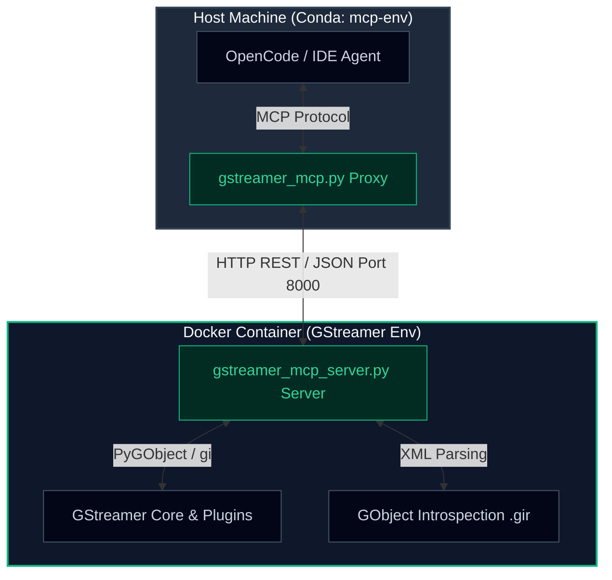

# Docker Images

This directory contains docker files used for generating docker images where the examples can be run.

* [Dockerfile-deepstream-6.0.1-devel](Dockerfile-deepstream-6.0.1-devel)
  * Docker container with Deepstream 6.0.1 plus samples and Deepstream Python bindings
  * Based on nvcr.io/nvidia/deepstream:6.0.1-samples
  * glmark2 for testing OpenGL inside the container
  * mesa-utils for glxinfo
  * cuda-tookit
  * tensorrt-dev
  * gstreamer1.0-plugins-base
  * gstreamer1.0-plugins-good
  * gstreamer1.0-plugins-bad
  * gstreamer1.0-plugins-ugly
  * no nvinferserver (Triton) plug-in
* [Dockerfile-deepstream-6.1.1-devel](Dockerfile-deepstream-6.1.1-devel)
  * Docker container with DeepStream 6.1.1 plus samples and DeepStream Python bindings
  * Based on nvcr.io/nvidia/deepstream:6.1.1-samples
  * glmark2 for testing OpenGL inside the container
  * mesa-utils for glxinfo
  * gstreamer1.0-plugins-base
  * gstreamer1.0-plugins-good
  * gstreamer1.0-plugins-bad
  * gstreamer1.0-plugins-ugly
* [Dockerfile-deepstream-6.3-triton-devel](Dockerfile-deepstream-6.3-triton-devel)
  * Docker container with DeepStream 6.3 plus samples, Triton, and DeepStream Python bindings
  * Based on nvcr.io/nvidia/deepstream:6.3-triton-multiarch
  * glmark2 for testing OpenGL inside the container
  * mesa-utils for glxinfo
  * With nvinferserver (Triton) plug-in
* [Dockerfile-deepstream-8.0](Dockerfile-deepstream-8.0)
  * Docker container with DeepStream 8.0 plus samples and DeepStream Python bindings
  * Based on nvcr.io/nvidia/deepstream:8.0-samples-multiarch
  * glmark2 for testing OpenGL inside the container
  * mesa-utils for glxinfo
  * gstreamer1.0-plugins-base
  * gstreamer1.0-plugins-good
  * gstreamer1.0-plugins-bad
  * gstreamer1.0-plugins-ugly
  * With nvinferserver (Triton) plug-in
  * PyTorch
* [Dockerfile-rtsp-server](Dockerfile-rtsp-server)
  * Docker container with RTSP GStreamer components
  * Based on ubuntu:20.04
  * gstreamer1.0-plugins-base
  * gstreamer1.0-plugins-good
  * gstreamer1.0-plugins-bad
  * gstreamer1.0-plugins-ugly
  * gstreamer1.0-rtsp
* [Dockerfile-gstreamer-1.28](Dockerfile-gstreamer-1.28)
  * Docker container with GStreamer version 1.28 and [burn-yoloxinference](https://gstreamer.freedesktop.org/documentation/burn/?gi-language=c)
  * Based on ubuntu:24.04
  * Rust toolchain
  * Model Context Protocol (MCP) ready
* [Dockerfile-gstreamer-1.28-cuda](Dockerfile-gstreamer-1.28-cuda)
  * Docker container with GStreamer version 1.28 and [burn-yoloxinference](https://gstreamer.freedesktop.org/documentation/burn/?gi-language=c)
  * Based on cuda:12.6.0-devel-ubuntu24.04
  * Tested with 5070 and 595.71.05 driver version
  * Rust toolchain
  * Model Context Protocol (MCP) ready

# 1 Creating Docker Images

Following sections show how to:

* Install Docker
* Build the Docker images

## 1.1 Installing Docker

If you want to create a Docker image that uses Nvidia's GPU, you first need to install Nvidia's Container Toolkit.
Instructions can be found here:

* https://docs.nvidia.com/datacenter/cloud-native/container-toolkit/install-guide.html

Once you have installed everything, verify that Nvidia's Container Toolkit is working by executing:

```bash
sudo docker run --rm --gpus all nvidia/cuda:11.6.2-base-ubuntu20.04 nvidia-smi
```

You should see output following (or similar) output:

```bash
+-----------------------------------------------------------------------------+
| NVIDIA-SMI 525.60.13    Driver Version: 525.60.13    CUDA Version: 12.0     |
|-------------------------------+----------------------+----------------------+
| GPU  Name        Persistence-M| Bus-Id        Disp.A | Volatile Uncorr. ECC |
| Fan  Temp  Perf  Pwr:Usage/Cap|         Memory-Usage | GPU-Util  Compute M. |
|                               |                      |               MIG M. |
|===============================+======================+======================|
|   0  NVIDIA GeForce ...  On   | 00000000:09:00.0  On |                  N/A |
| 32%   38C    P0    34W / 151W |    735MiB /  8192MiB |      0%      Default |
|                               |                      |                  N/A |
+-------------------------------+----------------------+----------------------+

+-----------------------------------------------------------------------------+
| Processes:                                                                  |
|  GPU   GI   CI        PID   Type   Process name                  GPU Memory |
|        ID   ID                                                   Usage      |
|=============================================================================|
+-----------------------------------------------------------------------------+
```

## 1.2 Create the Docker Image

After this you can create the docker image used in the examples.

```bash
docker build -t deepstream-6.3 -f ./Dockerfile-deepstream-6.3-triton-devel .
```

## 1.3 Test the Docker Image

Some of the examples use GStreamer plugin `nveglglessink` for showing the results in realtime. `nveglglessink`
depends on OpenGL, so making sure that OpenGL works inside the container is essential. Make sure that `DISPLAY`
environment variable has been set:

```bash
env | grep DISPLAY
```
If it is not set, then you need to set it:

```bash
export DISPLAY=:<DISPLAY_NR>
```

Replace `<DISPLAY_NR>` with the actual display which is typically `0` or `1`.

Then start the container:

```bash
xhost +
docker run -i -t --rm \
  -v /tmp/.X11-unix:/tmp/.X11-unix \
  -v $(pwd):/home/gstreamer-examples \
  -e DISPLAY=$DISPLAY \
  -e XAUTHORITY=$XAUTHORITY \
  -e NVIDIA_DRIVER_CAPABILITIES=all \
  --gpus all deepstream-6.3 bash
```

Then execute the following inside the container:

```bash
glxinfo | grep OpenGL
```

You should see something similar to:

```bash
OpenGL vendor string: NVIDIA Corporation
OpenGL renderer string: NVIDIA GeForce GTX 1070/PCIe/SSE2
OpenGL core profile version string: 4.6.0 NVIDIA 525.60.13
OpenGL core profile shading language version string: 4.60 NVIDIA
OpenGL core profile context flags: (none)
OpenGL core profile profile mask: core profile
OpenGL core profile extensions:
OpenGL version string: 4.6.0 NVIDIA 525.60.13
OpenGL shading language version string: 4.60 NVIDIA
OpenGL context flags: (none)
OpenGL profile mask: (none)
OpenGL extensions:
OpenGL ES profile version string: OpenGL ES 3.2 NVIDIA 525.60.13
OpenGL ES profile shading language version string: OpenGL ES GLSL ES 3.20
OpenGL ES profile extensions:
```

If the `OpenGL vendor string` is `NVIDIA Corporation`, execute an OpenGL test application inside the container:

```bash
glmark2
```

A window should pop-up, displaying a horse.

---

# 2. GStreamer MCP Documentation Server

This directory contains a **Model Context Protocol (MCP) Server** and GStreamer **Introspection Agent**. It is designed to bridge the gap between your local AI assistant (like OpenCode) and the heavy GStreamer libraries, pre-compiled plugins, and CUDA bindings running inside the container.

## 2.1 The Problem & Solution

GStreamer requires deep system library packages, complex compilation steps, and heavy GPU-accelerated video codecs (like Nvidia CUDA). Installing GStreamer directly on your local developer machine (macOS, Windows, or clean Linux installations) is difficult, prone to version mismatches, and can pollute your host system.

Our solution decouples the environment:
1. **Host Machine (Conda: `mcp-env`):** Runs a lightweight Python **MCP Proxy** (`gstreamer_mcp.py`) with zero GStreamer dependencies.
2. **Docker Container:** Houses the fully built GStreamer runtime (CPU or CUDA). It runs an **Introspection Agent** (`gstreamer_mcp_server.py`) over HTTP. When the proxy is queried, it requests accurate, version-specific details from the running container in milliseconds.



## 2.2 Features

* **`list_gst_elements` (Fast Discovery):** Uses GStreamer's live memory registry (`Gst.Registry`) inside the container to search and filter elements by keyword or **semantic class/category** (e.g. `Decoder`, `Encoder`, `Source`, `Sink`, `Demuxer`).
* **`get_gst_element_details` (Deep Inspection):** Generates a beautifully formatted Markdown schema of any element, showing typed property parameters, default values, readable/writable flags, and static pad template directions + caps alongside raw specifications.
* **`validate_gst_pipeline` (Self-Healing Validation Loop):** Perfroms a timed dry-run of a GStreamer pipeline string inside the container. Captures caps negotiation issues, state-transition failures, or missing link warnings. Automatically parses and simplifies log diagnostics so the AI agent can diagnose and fix its own pipeline errors.
* **`get_python_gst_docs` / `get_c_gst_docs` (API Docs):** Safely extracts version-accurate PyGObject Python signatures and direct C struct layouts directly from system introspection binaries.

## 2.3 Getting Started

### 1. Start the GStreamer Agent via Docker Compose

In the `docker/` directory, spin up either the CPU-based or CUDA-based documentation container:

```bash
# For standard CPU containers:
docker compose up --build gstreamer-docs-cpu

# For NVIDIA GPU/CUDA accelerated containers:
docker compose up --build gstreamer-docs-cuda
```

This starts the GStreamer agent FastAPI server inside the container, forwarding port `8000` to the host. You can open your host browser at `http://localhost:8000/` to inspect the live developer dashboard and interactive API playgrounds (`/docs` or `/redoc`).

### 2. Configure Your MCP Client

To ensure OpenCode or Claude Desktop runs the MCP server inside your dedicated Conda environment (`mcp-env`), use `conda run` in your configuration. This avoids path resolution issues on your host.

#### Option A: OpenCode Configuration

Add the following config snippet to your OpenCode configuration block (e.g., inside `.opencode/opencode.json`):

```json
  "mcp": {
    "gstreamer": {
      "type": "local",
      "command": [
        "conda",
        "run",
        "-n",
        "mcp-env",
        "--no-capture-output",
        "python3",
        "<PATH-TO-PROJECTS>/gstreamer-examples/docker/gstreamer_mcp.py"
      ],
      "environment": {
        "GST_DOCS_AGENT_URL": "http://localhost:8000"
      }
    }
  }
```

#### Option B: Claude Desktop Configuration

Add the following config snippet to your Claude Desktop configuration file (`claude_desktop_config.json`):

```json
{
  "mcpServers": {
    "gstreamer": {
      "command": "conda",
      "args": [
        "run",
        "-n",
        "mcp-env",
        "--no-capture-output",
        "python3",
        "<PATH-TO-PROJECTS>/gstreamer-examples/docker/gstreamer_mcp.py"
      ],
      "env": {
        "GST_DOCS_AGENT_URL": "http://localhost:8000"
      }
    }
  }
}
```

Replace `<PATH-TO-PROJECTS>` with the absolute path where the `gstreamer-examples` repo was cloned on your host machine.

#### Where to Find Configuration Files

Depending on your operating system and preferred client, you can find the configuration files in the following standard directories:

| Client / Tool | OS | Configuration Path |
| :--- | :--- | :--- |
| **OpenCode** | **Ubuntu / Linux** | `~/.config/opencode/opencode.json`<br>*(or workspace-level `.opencode/opencode.json`)* |
| | **macOS** | `~/Library/Application Support/opencode/opencode.json`<br>*(or workspace-level `.opencode/opencode.json`)* |
| | **Windows** | `%APPDATA%\opencode\opencode.json`<br>*(or workspace-level `.opencode\opencode.json`)* |
| **Claude Desktop** | **macOS** | `~/Library/Application Support/Claude/claude_desktop_config.json` |
| | **Windows** | `%APPDATA%\Claude\claude_desktop_config.json`<br>*(Resolves to `C:\Users\<user>\AppData\Roaming\Claude\claude_desktop_config.json`)* |
| | **Ubuntu / Linux** | `~/.config/Claude/claude_desktop_config.json`<br>*(Note: officially unofficial on Linux)* |

### 3. Debugging with the MCP Developer Inspector

The **MCP Developer Inspector** (`mcp dev ...`) is an interactive command-line utility provided by the MCP SDK. It starts a local, interactive web-based console to let you manually trigger and visually inspect the GStreamer documentation tools (like searching elements, validating pipelines, or checking properties) before loading them into your primary IDE:

Activate your environment and point the inspector directly to your proxy:
```bash
conda activate mcp-env
mcp dev gstreamer-examples/docker/gstreamer_mcp.py
```
This opens a local developer portal where you can click "Run Tool" on `list_gst_elements` or `validate_gst_pipeline` to test the entire host-to-container loop easily.


