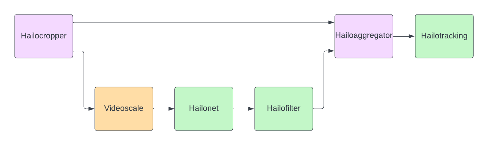

# Tracking

This example shows how to run an object detector in a cascade network. `Hailocropper` acts as a tee-element, it splits the stream into two. First branch passes
the stream through as it is while the second branch downscales the image for the object detector, applies object detection and post-processing. `Hailoaggregator`
element re-scales the bounding boxes to the original frame size. Following figure shows what the cropper- and agregator part of the pipeline looks like.



By doing object detection in a separate branch we can keep the original image size for display purposes.

## Tracking Parameters

A parameter called `class-id` in the `hailotracker` defines which object classes, detected by the detector, are tracked. If you want to track all the
object classes detected by the detector, use `class-id=-1`.

## Running the Example with Videosink

You can execute the tracking-example as follows:

```bash
gst-launch-1.0 \
filesrc location=./input.mp4 name=src_0 ! \
decodebin ! videoconvert n-threads=1 qos=false ! video/x-raw,format=RGB ! \
hailocropper so-path=/local/workspace/tappas/apps/gstreamer/libs/post_processes//cropping_algorithms/libwhole_buffer.so function-name=create_crops use-letterbox=true resize-method=inter-area internal-offset=true name=cropper1 \
hailoaggregator name=agg1 \
cropper1. ! queue name=bypess1_q leaky=no max-size-buffers=30 max-size-bytes=0 max-size-time=0 ! agg1. \
cropper1. ! \
queue leaky=no max-size-buffers=30 max-size-bytes=0 max-size-time=0 ! \
videoscale qos=false n-threads=2 ! \
video/x-raw, pixel-aspect-ratio=1/1 ! \
queue leaky=no max-size-buffers=30 max-size-bytes=0 max-size-time=0 ! \
hailonet hef-path=/local/workspace/tappas/apps/gstreamer/general/detection/resources/yolov5m_wo_spp_60p.hef batch-size=1 ! \
queue leaky=no max-size-buffers=30 max-size-bytes=0 max-size-time=0 ! \
hailofilter function-name=yolov5 so-path=/local/workspace/tappas/apps/gstreamer/libs/post_processes//libyolo_post.so config-path=/local/workspace/tappas/apps/gstreamer/general/detection/resources/configs/yolov5.json qos=false ! \
queue leaky=no max-size-buffers=30 max-size-bytes=0 max-size-time=0 ! agg1. \
agg1. ! hailotracker name=hailo_tracker class-id=1 kalman-dist-thr=0.8 iou-thr=0.8 init-iou-thr=0.8 keep-new-frames=4 keep-tracked-frames=10 keep-lost-frames=8 qos=false ! \
queue leaky=no max-size-buffers=30 max-size-bytes=0 max-size-time=0 ! \
hailooverlay qos=false ! \
queue leaky=no max-size-buffers=30 max-size-bytes=0 max-size-time=0 ! \
videoconvert n-threads=2 qos=false ! \
fpsdisplaysink video-sink=xvimagesink name=hailo_display sync=false
```

If you want to display the video in normal speed, remove `sync=false` from the `fpsdisplaysink`.

## Running the Example with Filesink

You can execute the tracking-example as follows:

```bash
gst-launch-1.0 \
filesrc location=./input.mp4 name=src_0 ! \
decodebin ! videoconvert n-threads=1 qos=false ! video/x-raw,format=RGB ! \
hailocropper so-path=/local/workspace/tappas/apps/gstreamer/libs/post_processes//cropping_algorithms/libwhole_buffer.so function-name=create_crops use-letterbox=true resize-method=inter-area internal-offset=true name=cropper1 \
hailoaggregator name=agg1 \
cropper1. ! queue name=bypess1_q leaky=no max-size-buffers=30 max-size-bytes=0 max-size-time=0 ! agg1. \
cropper1. ! \
queue leaky=no max-size-buffers=30 max-size-bytes=0 max-size-time=0 ! \
videoscale qos=false n-threads=2 ! \
video/x-raw, pixel-aspect-ratio=1/1 ! \
queue leaky=no max-size-buffers=30 max-size-bytes=0 max-size-time=0 ! \
hailonet hef-path=/local/workspace/tappas/apps/gstreamer/general/detection/resources/yolov5m_wo_spp_60p.hef batch-size=1 ! \
queue leaky=no max-size-buffers=30 max-size-bytes=0 max-size-time=0 ! \
hailofilter function-name=yolov5 so-path=/local/workspace/tappas/apps/gstreamer/libs/post_processes//libyolo_post.so config-path=/local/workspace/tappas/apps/gstreamer/general/detection/resources/configs/yolov5.json qos=false ! \
queue leaky=no max-size-buffers=30 max-size-bytes=0 max-size-time=0 ! agg1. \
agg1. ! hailotracker name=hailo_tracker class-id=1 kalman-dist-thr=0.8 iou-thr=0.8 init-iou-thr=0.8 keep-new-frames=4 keep-tracked-frames=10 keep-lost-frames=8 qos=false ! \
queue leaky=no max-size-buffers=30 max-size-bytes=0 max-size-time=0 ! \
hailooverlay qos=false ! \
queue leaky=no max-size-buffers=30 max-size-bytes=0 max-size-time=0 ! \
videoconvert n-threads=2 qos=false ! \
queue leaky=no max-size-buffers=30 max-size-bytes=0 max-size-time=0 ! \
x264enc bitrate=6000 ! h264parse ! matroskamux ! filesink location=./output.mp4 sync=false
```
